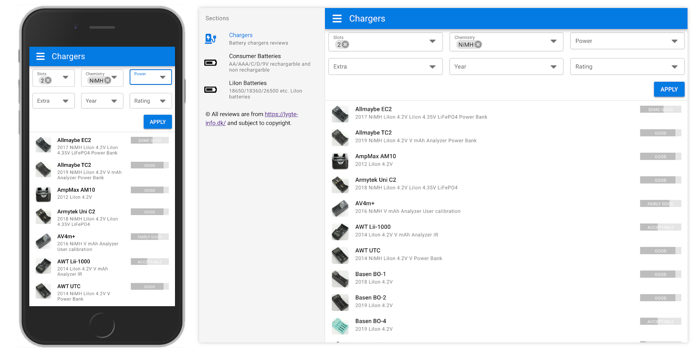

# Lygte-Info Reviews

[](https://app.netlify.com/sites/lygte/deploys)

A Quasar application for filtering and sorting electronics reviews from https://lygte-info.dk website.



Demo is available at https://lygte-reviews.netlify.com/

## Copyright notice

All reviews in this application and repository are from https://lygte-info.dk and subject to copyright.

## Installation

Dependencies
```bash
npm install
```
Start the app in development mode (hot-code reloading, error reporting, etc.)
```bash
quasar dev
```
Build the app for production
```bash
quasar build
```

